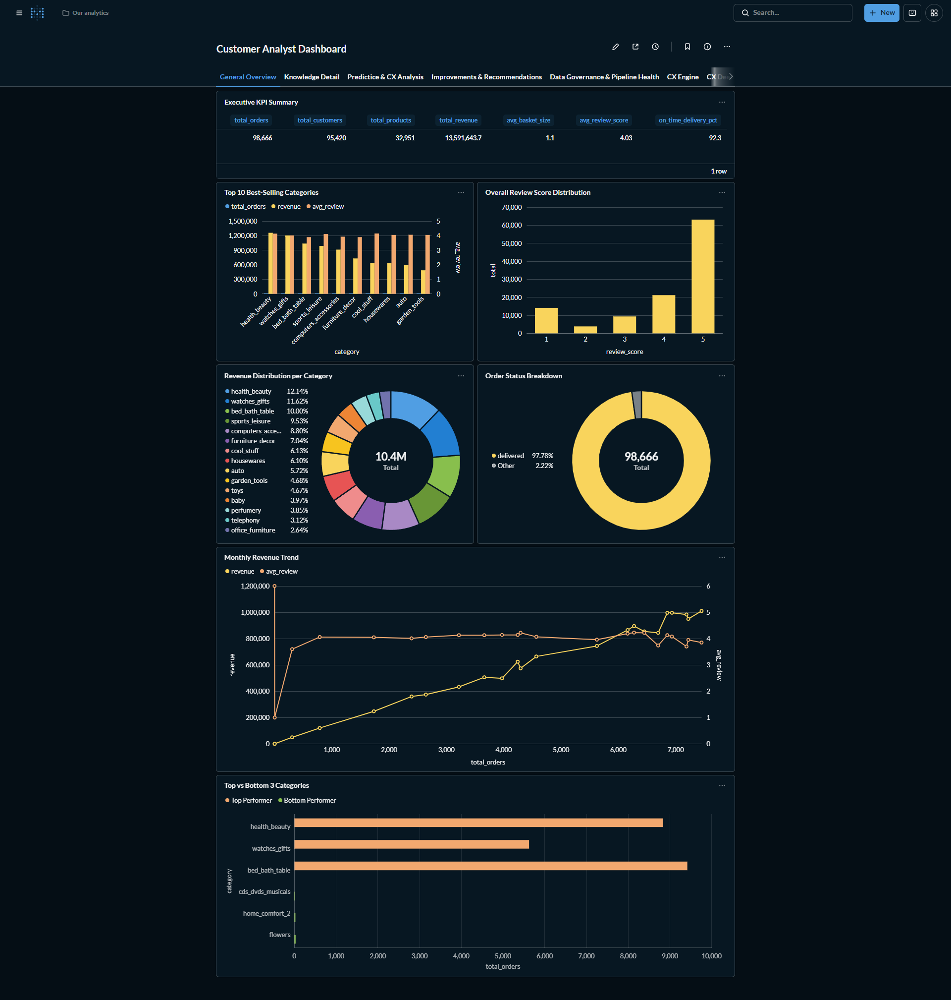
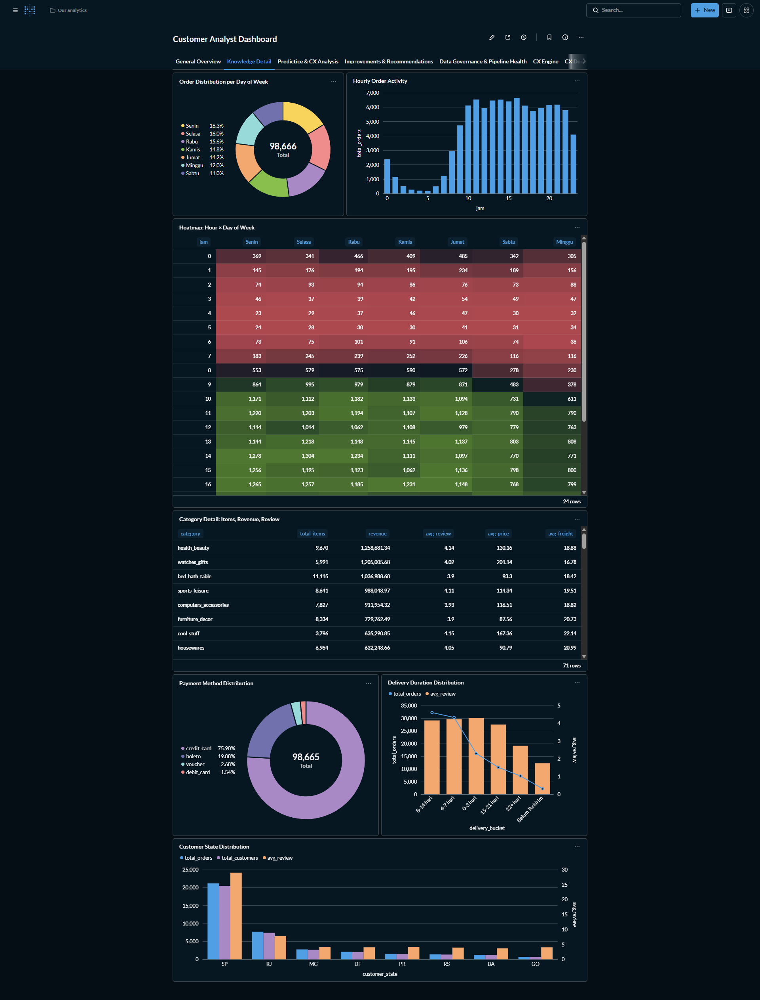
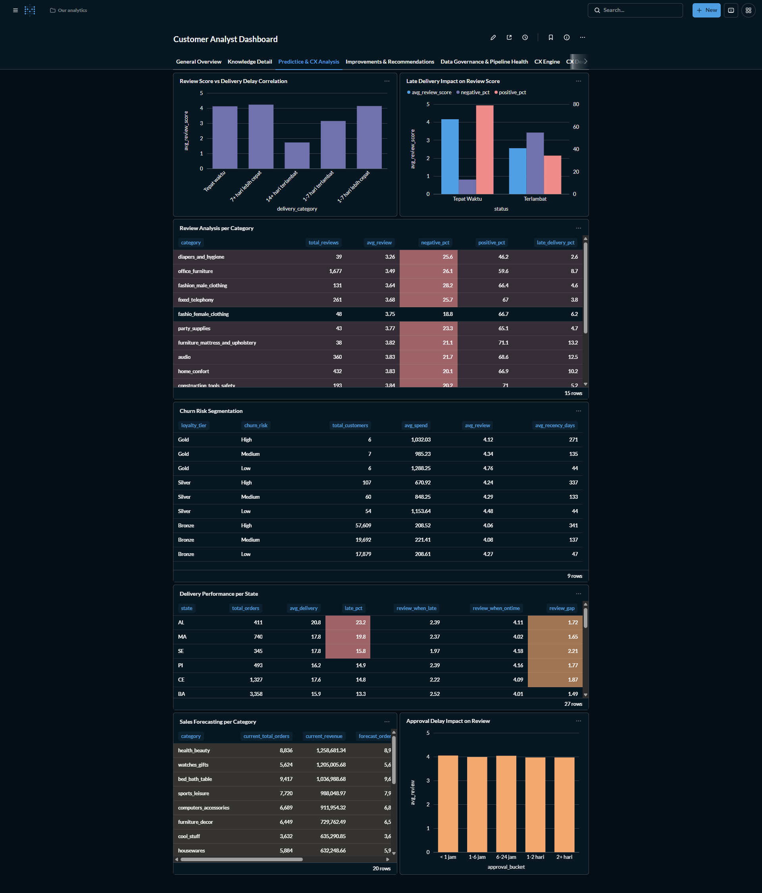
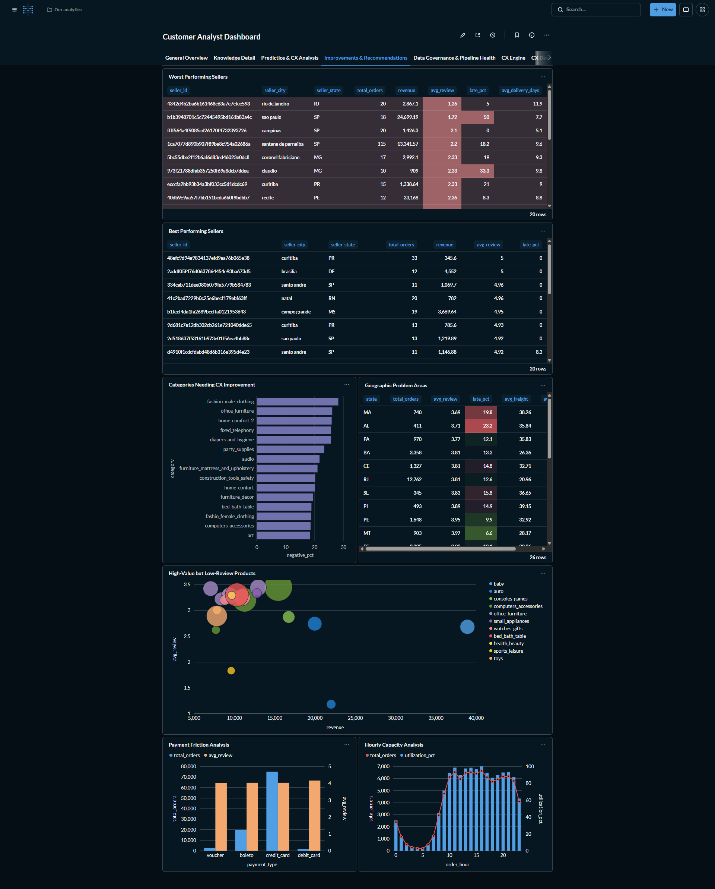
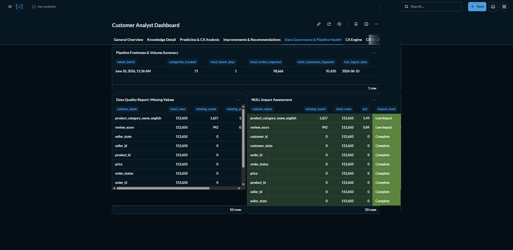
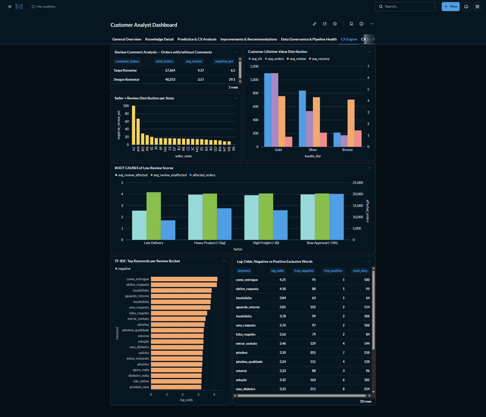
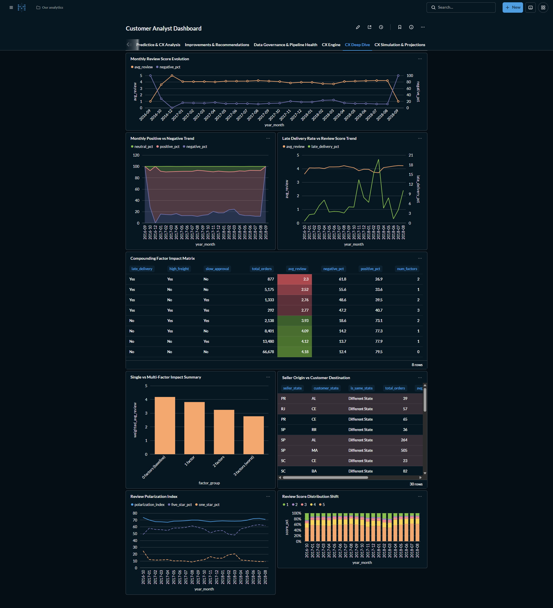
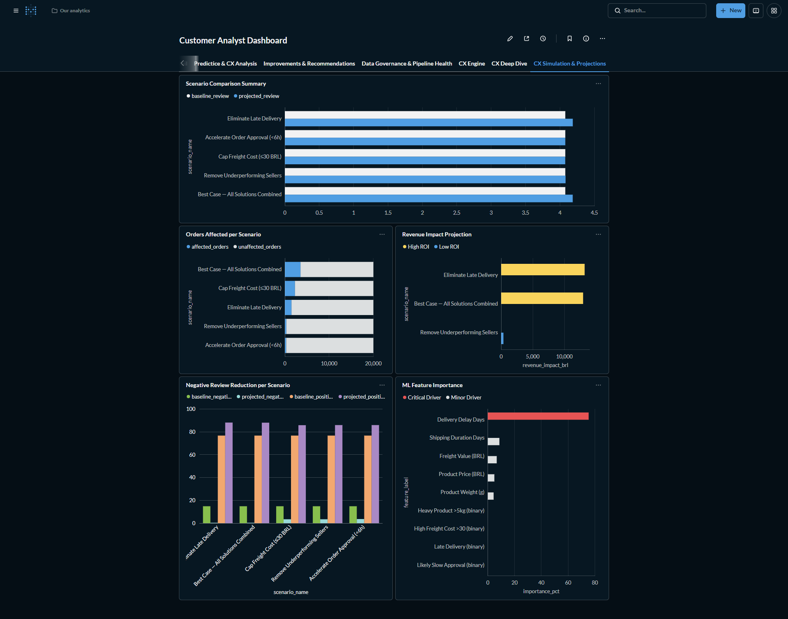

# 📊 Query Documentation — Dustinia Delixia Groceria CX Dashboard

> **Database:** ClickHouse (`orders_db` + `analytics`)  
> **Pipeline:** CSV → PySpark → ClickHouse → Metabase  
> **Dataset:** Olist Brazilian E-Commerce (adapted)  
> **Focus:** Customer Experience — Why are review scores stagnant?  
> **Author:** Raymond Julius Pardosi (5025241268)

---

## 🗂️ Dashboard Structure

| Tab | Name | Focus | Query Count |
|-----|------|-------|:------------:|
| 1 | **General Overview** | Executive KPIs, revenue, categories | 7 |
| 2 | **Knowledge Detail** | Time patterns, distribution, customer behavior | 7 |
| 3 | **Predictive & CX** | Review score analysis, delivery, churn | 7 |
| 4 | **Improvements** | Recommendations for sellers, categories, logistics | 7 |
| 5 | **Data Governance** | Pipeline health, data quality, freshness | 3 |
| 6 | **CX Engine** | Deep analysis: CLV, sentiment, root causes | 9 |
| 7 | **CX Deep Dive** | Review stagnation root causes, polarization | 11 |
| 8 | **CX Simulation** | What-If model: projected impact of solutions | 8 |
| | | **Total** | **56** |

---

##  TAB 1 — General Overview



### 🔢 Q1.1 — Executive KPI Summary
```sql
SELECT
    count(DISTINCT order_id)             AS total_orders,
    count(DISTINCT customer_unique_id)   AS total_customers,
    count(DISTINCT product_id)           AS total_products,
    round(sum(price), 2)                 AS total_revenue,
    round(count(*) / count(DISTINCT order_id), 1) AS avg_basket_size,
    round(avg(review_score), 2)          AS avg_review_score,
    round(countIf(is_late_delivery = 0) * 100.0 / countIf(is_late_delivery IS NOT NULL), 1) AS on_time_delivery_pct
FROM orders_db.order_items
```
**Function:** 7 KPI cards at the top of the dashboard — provides an instant C-level overview.  
**Visualization:** Number cards (no axis)  
**Displayed Columns:** `total_orders`, `total_customers`, `total_products`, `total_revenue`, `avg_basket_size`, `avg_review_score`, `on_time_delivery_pct`

---

### 🛍️ Q1.2 — Top 10 Best-Selling Categories
**Function:** Identifies the top 10 categories by revenue for stock strategy.  
**Visualization:** Horizontal bar chart  
**X Axis:** `revenue` (revenue value in BRL, numeric)  
**Y Axis:** `category` (product category name, categorical)  
**Tooltip:** `total_orders`, `avg_review`  
**Sort:** Descending by revenue (best-selling categories at the top)

---

### 📊 Q1.3 — Revenue Distribution per Category
**Function:** Revenue proportion per category — which one dominates.  
**Visualization:** Pie / Donut chart  
**Dimension (Label):** `category` (category name)  
**Value (Segment Size):** `revenue` (BRL)  
**Color:** Each segment represents one category  
**Note:** Filter `!= 'missing'` is used because NULLs are imputed as `'missing'` strings in PySpark

---

### ⭐ Q1.4 — Overall Review Score Distribution
**Function:** Distribution of review scores 1–5 — how many are satisfied vs unsatisfied.  
**Visualization:** Bar chart (5 bars)  
**X Axis:** `review_score` (values 1, 2, 3, 4, 5 — discrete/categorical)  
**Y Axis:** `total` (order count, numeric)  
**Color:** Gradient red (1) → green (5)

---

### 📦 Q1.5 — Order Status Breakdown
**Function:** Proportion of order statuses (delivered, shipped, canceled, etc.).  
**Visualization:** Pie chart  
**Dimension (Label):** `order_status`  
**Value (Segment Size):** `total_orders`  
**Color:** Each status has a different color

---

### 📈 Q1.6 — Monthly Revenue Trend
**Function:** Monthly trend of revenue and review scores — spotting stagnation.  
**Visualization:** Dual-axis line chart  
**X Axis:** `month` (YYYYMM format, chronological)  
**Y Axis (Left):** `revenue` (total revenue in BRL, numeric)  
**Y Axis (Right):** `avg_review` (average review score 1–5, numeric)  
**Series:** 2 lines — Revenue (blue area/line) & Avg Review (orange line)  
**Tooltip:** `total_orders`, `revenue`, `avg_review`

---

### 🏆 Q1.7 — Top vs Bottom 3 Categories
**Function:** Contrast between the best and worst categories for merchandising strategy.  
**Visualization:** Comparative table  
**Columns:** `category`, `total_orders`, `revenue`, `avg_review`, `label`  
**Row Color:** Green for Top Performer, Red for Bottom Performer  
**Sort:** Top 3 (highest revenue) followed by Bottom 3 (lowest revenue, min 10 orders)

---

##  TAB 2 — Knowledge Detail



###  Q2.1 — Order Distribution per Day of Week
**Function:** Which days do customers order the most?  
**Visualization:** Bar chart (7 bars)  
**X Axis:** `hari` (Monday–Sunday, ordered categorical)  
**Y Axis:** `total_orders` (unique order count, numeric)  
**Color:** Single color or intensity gradient

---

###  Q2.2 — Hourly Order Activity
**Function:** Peak and off-peak hours — for capacity planning.  
**Visualization:** Area chart  
**X Axis:** `jam` (0–23, numeric/discrete)  
**Y Axis:** `total_orders` (order count, numeric)  
**Additional Series:** `revenue` (optional, secondary axis)  
**Tooltip:** `total_orders`, `total_items`, `revenue`

---

###  Q2.3 — Heatmap: Hour × Day of Week
**Function:** Order intensity map by hour and day — identifying peak times.  
**Visualization:** Heatmap / Pivot table  
**X Axis (Columns):** Day (Monday–Sunday)  
**Y Axis (Rows):** `jam` (0–23)  
**Cell Value:** Order count  
**Color:** Gradient white → dark blue (darker = more crowded)

---

###  Q2.4 — Category Detail: Items, Revenue, Review
**Function:** Detail table per category — revenue, review, average price.  
**Visualization:** Table with sorting  
**Columns:** `category`, `total_items`, `revenue`, `avg_review`, `avg_price`, `avg_freight`  
**Default Sort:** Descending by `revenue`  
**Conditional Formatting:** `avg_review` < 3.5 → red, ≥ 4.0 → green

---

###  Q2.5 — Payment Method Distribution
**Function:** Which payment method is most popular and its review scores.  
**Visualization:** Pie chart + table  
**Pie — Dimension:** `payment_type`  
**Pie — Value:** `total_orders`  
**Table — Columns:** `payment_type`, `total_orders`, `revenue`, `avg_review`  
**Tooltip:** `avg_review` (to see satisfaction per payment method)

---

###  Q2.6 — Delivery Duration Distribution
**Function:** Distribution of delivery times and correlation with review score.  
**Visualization:** Bar chart with review overlay  
**X Axis:** `delivery_bucket` (0–3 days, 4–7 days, 8–14 days, 15–21 days, 22+ days — ordered categorical)  
**Y Axis (Left):** `total_orders` (order count, numeric)  
**Y Axis (Right):** `avg_review` (average review score, numeric)  
**Series:** Bar = total_orders, Line = avg_review  
**Insight:** Longer delivery time → avg_review drops significantly

---

###  Q2.7 — Customer State Distribution
**Function:** Customer distribution per state — which one is the largest.  
**Visualization:** Bar chart / Map  
**X Axis:** `customer_state` (Brazil state code, categorical)  
**Y Axis:** `total_orders` (order count, numeric)  
**Color:** Gradient based on order volume  
**Tooltip:** `revenue`, `avg_review`, `total_customers`

---

##  TAB 3 — Predictive & CX Analysis ( KEY TAB)



###  Q3.1 — Review Score vs Delivery Delay Correlation
```sql
SELECT
    CASE
        WHEN delivery_delay_days <= -7 THEN '7+ days early'
        WHEN delivery_delay_days <= -1 THEN '1-7 days early'
        WHEN delivery_delay_days <= 0 THEN 'On time'
        WHEN delivery_delay_days <= 7 THEN '1-7 days late'
        ELSE '14+ days late'
    END AS delivery_category,
    count(DISTINCT order_id) AS total_orders,
    round(avg(review_score), 2) AS avg_review_score
FROM orders_db.order_items
WHERE review_score IS NOT NULL
GROUP BY delivery_category
```
**Function:**  KEY CORRELATION — proves that delivery delays directly lower review scores. This is the primary ROOT CAUSE.  
**Visualization:** Bar chart with color gradient  
**X Axis:** `delivery_category` (5 delay buckets, ordered from early → very late)  
**Y Axis:** `avg_review_score` (average review 1–5, numeric)  
**Color:** Gradient green (early) → red (very late)  
**Tooltip:** `total_orders`, `avg_review_score`  
**Insight:** Deliveries late by >7 days result in an average review score of 1.5–2.0, while on-time deliveries yield 4.0+

---

###  Q3.2 — Late Delivery Impact on Review Score
**Function:** Direct comparison of review scores between on-time vs late orders.  
**Visualization:** Comparative bar chart  
**X Axis:** `status` (2 categories: "On Time" vs "Late")  
**Y Axis:** `avg_review_score` (numeric, 1–5 scale)  
**Additional Series:** `negative_pct` & `positive_pct` (can be displayed as labels above bars)  
**Color:** Green = On Time, Red = Late  
**Tooltip:** `total_orders`, `avg_review_score`, `negative_pct`, `positive_pct`  
**Insight:** The review score gap between on-time vs late can reach 1.5–2.0 points

---

###  Q3.3 — Review Analysis per Category
**Function:** Which category has the most negative reviews? What is the correlation with late delivery?  
**Visualization:** Table sorted by avg_review ascending  
**Columns:** `category`, `total_reviews`, `avg_review`, `negative_pct`, `positive_pct`, `late_delivery_pct`  
**Sort:** Ascending by `avg_review` (worst categories at the top)  
**Conditional Formatting:** `avg_review` < 3.0 → red, `negative_pct` > 20% → red

---

###  Q3.4 — Churn Risk Segmentation (RFM Matrix)
**Function:** Customer segmentation based on RFM — identifying churn-risk customers.  
**Visualization:** RFM Matrix heatmap / pivot table  
**X Axis (Columns):** `churn_risk` (Low, Medium, High)  
**Y Axis (Rows):** `loyalty_tier` (Bronze, Silver, Gold)  
**Cell Value:** `total_customers` (customer count per combination)  
**Cell Color:** Gradient — red if High Risk + Bronze (most critical)  
**Tooltip:** `avg_spend`, `avg_review`, `avg_recency_days`

---

###  Q3.5 — Delivery Performance per State
**Function:** Which state has the most delivery problems? What is the impact on reviews?  
**Visualization:** Table with conditional formatting  
**Columns:** `state`, `total_orders`, `avg_delivery`, `late_pct`, `review_when_late`, `review_when_ontime`, `review_gap`  
**Sort:** Descending by `late_pct` (worst states at the top)  
**Conditional Formatting:** `late_pct` > 15% → red, `review_gap` > 1.5 → orange

---

###  Q3.6 — Sales Forecasting per Category
**Function:** Demand projection per category based on historical growth rates.  
**Visualization:** Table with risk level badges  
**Columns:** `category`, `current_total_orders`, `current_revenue`, `forecast_orders`, `forecast_revenue`, `growth_pct`, `risk_level`  
**Sort:** Descending by `current_revenue`  
**Badge Color:** risk_level: High Risk = red, Medium = yellow, Low = green

---

###  Q3.7 — Approval Delay Impact on Review
**Function:** Does approval time affect customer satisfaction?  
**Visualization:** Bar chart  
**X Axis:** `approval_bucket` (< 1 hour, 1–6 hours, 6–24 hours, 1–2 days, 2+ days — ordered categorical)  
**Y Axis:** `avg_review` (average review score, numeric)  
**Tooltip:** `total_orders`, `avg_review`  
**Color:** Gradient green (fast) → red (very slow)  
**Insight:** Approval > 24 hours shows a consistent decline in reviews

---

##  TAB 4 — Improvements & Recommendations



###  Q4.1 — Worst Performing Sellers
**Function:** 20 sellers with the worst reviews — priority targets for improvement.  
**Visualization:** Table (sortable)  
**Columns:** `seller_id`, `seller_city`, `seller_state`, `total_orders`, `revenue`, `avg_review`, `late_pct`, `avg_delivery_days`  
**Sort:** Ascending by `avg_review_score` (worst sellers at the top)  
**Filter:** `total_orders >= 10` (to avoid small sample sizes)  
**Conditional Formatting:** `avg_review` < 2.5 → red, `late_pct` > 30% → red  
**Recommendation:** Evaluate sellers with avg_review < 3.0, especially those with high late delivery rates

---

###  Q4.2 — Best Performing Sellers
**Function:** Benchmark — what are the best sellers doing?  
**Visualization:** Table (sortable)  
**Columns:** `seller_id`, `seller_city`, `seller_state`, `total_orders`, `revenue`, `avg_review`, `late_pct`  
**Sort:** Descending by `avg_review_score`  
**Filter:** `total_orders >= 10`  
**Conditional Formatting:** `avg_review` >= 4.5 → green  
**Recommendation:** Study the patterns of sellers with 4.5+ reviews to replicate their success

---

###  Q4.3 — Categories Needing CX Improvement
**Function:** Categories with the highest negative reviews — requires intervention.  
**Visualization:** Bar chart (horizontal)  
**X Axis:** `negative_pct` (percentage of negative reviews, numeric)  
**Y Axis:** `category` (category name, categorical)  
**Tooltip:** `total_reviews`, `avg_review`, `late_delivery_pct`, `avg_freight`  
**Sort:** Descending by `negative_review_pct`  
**Color:** Red (highest negative) → yellow  
**Recommendation:** Evaluate if the issue is with the product, shipping, or seller

---

###  Q4.4 — Geographic Problem Areas
**Function:** States with the highest late delivery rates — logistics issues.  
**Visualization:** Table with conditional formatting  
**Columns:** `state`, `total_orders`, `avg_review`, `late_pct`, `avg_freight`, `avg_delivery`  
**Sort:** Ascending by `avg_review_score` (worst states at the top)  
**Filter:** `total_orders >= 50`  
**Conditional Formatting:** `late_pct` > 20% → red, `avg_review` < 3.5 → red  
**Recommendation:** Consider additional warehouses or new logistics partners

---

###  Q4.5 — Payment Friction Analysis
**Function:** Which payment method correlates with low reviews?  
**Visualization:** Grouped bar chart  
**X Axis:** `payment_type` (credit_card, boleto, voucher, debit_card — categorical)  
**Y Axis (Left):** `total_orders` (numeric)  
**Y Axis (Right):** `avg_review` (numeric, 1–5 scale)  
**Tooltip:** `avg_installments`, `avg_value`, `avg_review`  
**Recommendation:** Evaluate the checkout UX per payment method

---

###  Q4.6 — High-Value but Low-Review Products
**Function:** High revenue but low review products — most urgent to fix.  
**Visualization:** Scatter plot / Table  
**Columns:** `product_id`, `category`, `total_orders`, `revenue`, `avg_review`, `total_unique_buyers`  
**Filter:** `total_orders >= 5` AND `avg_review_score < 3.5`  
**Sort:** Descending by `revenue`  
**Scatter — X Axis:** `revenue`  
**Scatter — Y Axis:** `avg_review`  
**Bubble Size:** `total_orders`  
**Recommendation:** Priority QA/QC for these products

---

###  Q4.7 — Hourly Capacity Analysis
**Function:** When are peak hours? Is capacity sufficient?  
**Visualization:** Bar chart with line overlay  
**X Axis:** `order_hour` (0–23, numeric/discrete)  
**Y Axis (Left):** `total_orders` (order count, numeric)  
**Y Axis (Right):** `utilization_pct` (capacity utilization %, numeric)  
**Bar Color:** Red = Peak, Yellow = Normal, Green = Low  
**Tooltip:** `avg_items`, `utilization_pct`, `peak_label`  
**Recommendation:** Scale up customer service and logistics during peak hours

---

##  TAB 5 — Data Governance & Pipeline Health



### Q5.1 — Data Quality Report: Missing Values
**Function:** Transparency audit — which columns have high missing data?  
**Visualization:** Bar chart + table  
**X Axis:** `column_name` (column name, categorical)  
**Y Axis:** `missing_pct` (percentage of missing data, numeric 0–100%)  
**Color:** Red = > 10%, Yellow = 5–10%, Green = < 5%  
**Table Columns:** `column_name`, `total_rows`, `missing_count`, `missing_pct`, `ingested_date`

---

### Q5.2 — Pipeline Freshness & Volume Summary
**Function:** Comprehensive one-line summary — when was the last batch, how many categories tracked, total orders & customers ingested.  
**Visualization:** Number cards (6 KPIs)  
**Displayed Columns:** `latest_batch`, `categories_tracked`, `total_batch_days`, `total_orders_ingested`, `total_customers_ingested`, `last_ingest_date`  
**Note:** Q5.2 and Q5.3 (Data Volume) are combined into this single query for efficiency.

---

### Q5.3 — NULL Impact Assessment
**Function:** How big is the impact of missing data on analytical accuracy?  
**Visualization:** Table with badge  
**Columns:** `column_name`, `missing_count`, `total_rows`, `pct`, `impact_level`  
**Badge Color:** High Impact = red, Medium = yellow, Low/Complete = green  
**Sort:** Descending by `missing_pct`

---

##  TAB 6 — CX Engine (Deep Analysis)



###  Q6.1 — Customer Lifetime Value Distribution
**Function:** CLV per loyalty tier — who are the most valuable customers?  
**Visualization:** Grouped bar chart  
**X Axis:** `loyalty_tier` (Bronze, Silver, Gold — categorical)  
**Y Axis:** `avg_clv` (average total spend per customer, BRL)  
**Series:** `avg_orders`, `avg_review`, `avg_recency` (as metric cards or tooltips)  
**Color:** Bronze = brown, Silver = gray, Gold = gold  
**Tooltip:** `total_customers`, `avg_clv`, `avg_orders`, `avg_review`

---

###  Q6.2 — Review Comment Analysis
**Function:** Do customers who write comments tend to give lower reviews?  
**Visualization:** Comparative bar chart  
**X Axis:** `comment_status` (2 categories: "With Comment" vs "Without Comment")  
**Y Axis:** `avg_review` (average review score, numeric)  
**Tooltip:** `total_orders`, `avg_review`, `negative_pct`  
**Insight:** Orders with comments tend to have lower reviews (disappointed customers are more motivated to write)

---

###  Q6.3 — Review Score Trend over Time
**Function:** Monthly review score trend — is it really stagnant?  
**Visualization:** Multi-line chart  
**X Axis:** `month` (YYYY-MM, chronological)  
**Y Axis (Left):** `avg_review` (average review score, numeric, 1–5 scale)  
**Y Axis (Right):** `positive_pct` & `negative_pct` (percentage, numeric 0–100%)  
**Series:** 3 lines — avg_review (blue), positive_pct (green), negative_pct (red)  
**Tooltip:** `total_orders`, `avg_review`, `positive_pct`, `negative_pct`

---

###  Q6.4 — ROOT CAUSES of Low Review Scores
```sql
SELECT
    'Late Delivery' AS factor,
    round(avg(CASE WHEN is_late_delivery = 1 THEN review_score END), 2) AS avg_review_affected,
    round(avg(CASE WHEN is_late_delivery = 0 THEN review_score END), 2) AS avg_review_unaffected,
    round(...) AS impact_delta,
    countIf(is_late_delivery = 1) AS affected_orders
FROM orders_db.order_items
```
**Function:** MOST IMPORTANT QUERY — comparing the 4 main factors causing low reviews:  
1. **Late Delivery** — most dominant factor  
2. **High Freight** — expensive shipping lowers expectations  
3. **Slow Approval** — approval delays frustrate customers  
4. **Heavy Product** — heavy products take longer to ship  

**Visualization:** Grouped bar chart (2 bars per factor)  
**X Axis:** `factor` (4 factors: Late Delivery, High Freight, Slow Approval, Heavy Product)  
**Y Axis:** `avg_review` (numeric, 1–5 scale)  
**Series:** 2 bars per factor — `avg_review_affected` (red) vs `avg_review_unaffected` (green)  
**Annotation:** `impact_delta` displayed as label between two bars  
**Tooltip:** `affected_orders`, `avg_review_affected`, `avg_review_unaffected`, `impact_delta`  
**Insight for CEO:** Stagnant review scores are not due to one factor, but a combination of delivery issues affecting ~15–25% of orders

---

###  Q6.5 — TF-IDF: Top Keywords per Review Bucket
**Function:** Identify phrases that most exclusively appear in negative reviews using TF-IDF scores and N-Grams (Paper Methodology).  
**Visualization:** Horizontal Bar Chart  
**X Axis:** `tfidf_score` (Word weighting score)  
**Y Axis:** `keyword` (Phrase / N-Gram)  
**Filter:** `review_bucket = 'negative'`  
**Insight:** Discovers specific root causes such as 'no response', 'item not received', etc.

---

###  Q6.6 — Log-Odds: Negative vs Positive Exclusive Words
**Function:** Identifies which words are statistically used much more frequently in bad reviews compared to good reviews.  
**Visualization:** Table with conditional formatting  
**Columns:** `keyword`, `log_odds`, `freq_negative`, `freq_positive`, `total_docs`  
**Sort:** `log_odds` DESC (most indicative of negative reviews at the top)  
**Insight:** Validates that the biggest problems lie in customer service and shipping complaints.

---

##  TAB 7 — CX Deep Dive: Review Stagnation Analysis (11 Queries)



Special tab to answer the CEO's question: "Why are review scores hard to improve and tending to stagnate?"

###  Q7.1 — Monthly Review Score Evolution
- **Function**: Track avg review score, positive/negative/neutral percentage month-over-month
- **Data Source**: `analytics.monthly_review_trend`
- **Visualization**: Line chart (dual axis)
- **X Axis**: `year_month` (format 'YYYY-MM', chronological)
- **Y Axis (Left)**: `avg_review` (average review score, 1–5 scale)
- **Y Axis (Right)**: `negative_pct` (% negative reviews, 0–100% scale)
- **Series**: avg_review (blue), negative_pct (red)
- **Tooltip**: `total_reviews`, `total_orders`, `positive_pct`, `neutral_pct`, `negative_pct`
- **Insight**: Shows the exact trajectory of review scores — is it truly stagnant, declining, or fluctuating?

---

###  Q7.2 — Monthly Positive vs Negative Trend
- **Function**: Visualize shift between positive, neutral, and negative review proportions over time
- **Data Source**: `analytics.monthly_review_trend`
- **Visualization**: 100% Stacked area chart
- **X Axis**: `year_month` (chronological)
- **Y Axis**: Cumulative percentage (0–100%)
- **Series**: `positive_pct` (green), `neutral_pct` (gray), `negative_pct` (red)
- **Tooltip**: `positive_pct`, `neutral_pct`, `negative_pct` per month
- **Insight**: Even if average is stable, the composition may be shifting — growing negatives offset by growing positives

---

###  Q7.3 — Late Delivery Rate vs Review Score Trend
- **Function**: Overlay late_delivery_pct on avg_review score month-by-month
- **Data Source**: `analytics.monthly_review_trend`
- **Visualization**: Dual-axis line chart
- **X Axis**: `year_month` (chronological)
- **Y Axis (Left)**: `avg_review` (1–5 scale)
- **Y Axis (Right)**: `late_delivery_pct` (0–100% scale)
- **Series**: avg_review (solid blue), late_delivery_pct (dashed red)
- **Tooltip**: `avg_delay_days`, `avg_freight`, `avg_review`, `late_delivery_pct`
- **Insight**: Shows temporal correlation — when late deliveries spike, do reviews drop proportionally?

---

###  Q7.4 — Compounding Factor Impact Matrix
- **Function**: Cross-tabulate 3 binary factors (late delivery × high freight × slow approval) with avg review score
- **Data Source**: `analytics.review_root_cause_matrix`
- **Visualization**: Heatmap / Pivot table
- **Rows (Y)**: Factor combination (8 combinations: 0-factor up to 3-factor)
- **Columns (X)**: `is_late`, `is_high_freight`, `is_slow_approval` (Yes/No)
- **Cell Value**: `avg_review_score`
- **Cell Color**: Red (low review) → Green (high review)
- **Tooltip**: `total_orders`, `avg_review_score`, `negative_pct`, `positive_pct`
- **Insight**: Reveals compounding effects — e.g., late delivery alone drops review to ~2.5, but late + high freight drops to ~1.8

---

###  Q7.5 — Single vs Multi-Factor Impact Summary
- **Function**: Compare weighted avg review when 0, 1, 2, or 3 negative factors are present
- **Data Source**: `analytics.review_root_cause_matrix`
- **Visualization**: Bar chart
- **X Axis**: `factor_group` (0 factors, 1 factor, 2 factors, 3 factors — ordered categorical)
- **Y Axis**: `weighted_avg_review` (weighted average review, numeric)
- **Color**: Gradient green (0 factors) → red (3 factors)
- **Tooltip**: `total_orders`, `weighted_avg_review`, `weighted_negative_pct`
- **Insight**: Quantifies the incremental damage of each additional negative factor

---

###  Q7.6 — Seller Origin vs Customer Destination
- **Function**: Show worst-performing seller→customer state routes by review score
- **Data Source**: `analytics.seller_state_review`
- **Visualization**: Table with conditional formatting
- **Columns**: `seller_state`, `customer_state`, `is_same_state`, `total_orders`, `avg_review`, `avg_shipping_days`, `late_pct`
- **Filter**: `total_orders >= 20`
- **Sort**: Ascending by `avg_rev- **Data Source**: `analytics.review_score_shift`
- **Visualization**: 100% Stacked bar chart
- **X Axis**: `year_month` (chronological)
- **Y Axis**: `score_pct` (IMPORTANT: Only put `score_pct` on the Y-Axis, remove other columns)
- **Series Breakout (Metabase)**: `review_score` (IMPORTANT: Click "Add series breakout" under X-Axis, DO NOT stack on Y-Axis)
- **Display Setting**: Open the Display tab -> change Stacking option to "100%"
- **Tooltip**: `review_score`, `total_count`, `score_pct` per month
- **Insight**: Detects polarization — if both 5 and 1 are growing while 3 shrinks, the average looks stable but customer experience is actually diverging

---

###  Q7.8 — Review Polarization Index
- **Function**: Track (1 + 5) / total percentage over time as a polarization metric
- **Data Source**: `analytics.review_score_shift`
- **Visualization**: Line chart
- **X Axis**: `year_month` (chronological)
- **Y Axis**: `polarization_index` (percentage, 0–100%)
- **Series**: polarization_index (solid purple), five_star_pct (dashed green), one_star_pct (dashed red)
- **Tooltip**: `extreme_count`, `total_count`, `polarization_index`, `five_star_pct`, `one_star_pct`
- **Insight**: Rising polarization index = average review looks stable but extremes are growing, suggesting fundamentally different customer segments having very different experiences

---

##  TAB 8 — CX Simulation & Projections: What-If Model (8 Queries)



Special tab to answer the question: **"If CX solutions are implemented, what will the review score data look like?"**

> **Model**: Random Forest Counterfactual Simulation  
> **Data Source**: `analytics.simulation_scenarios` + `analytics.simulation_feature_impact`  
> **Baseline**: 20,000 historical orders from `order_items_sample_colab.csv`

###  Q8.1 — Scenario Comparison Summary 
- **Function**: Main view — baseline vs projected avg review for 5 simulation scenarios
- **Data Source**: `analytics.simulation_scenarios`
- **Visualization**: Grouped bar chart (2 bars per scenario)
- **X Axis**: `scenario_name` (5 scenarios: S1–S5, categorical)
- **Y Axis**: `avg_review` (numeric, 1–5 scale)
- **Series**: `baseline_review` (gray/white) vs `projected_review` (blue/green)
- **Error Bar**: `ci_lower` – `ci_upper` (95% confidence interval)
- **Tooltip**: `review_delta`, `improvement_pct`, `affected_orders`, `affected_pct`, `model_type`
- **Insight**: Which scenario has the biggest impact on increasing review scores?

---

###  Q8.2 — Projected Review Score per Scenario 
- **Function**: Ranking scenarios based on projected avg review, with 95% confidence interval
- **Data Source**: `analytics.simulation_scenarios`
- **Visualization**: Horizontal bar chart with baseline reference line
- **X Axis**: `projected_avg_review` (numeric, 1–5 scale)
- **Y Axis**: `scenario_name` (categorical, sorted descending by projected review)
- **Reference Line**: `baseline_avg_review` = 4.078 (vertical line)
- **Color**: Gradient based on `impact_level` (High Impact = green, Low = gray)
- **Horizontal Error Bar**: `ci_lower_95` – `ci_upper_95`
- **Tooltip**: `delta`, `impact_level`, `ci_lower_95`, `ci_upper_95`
- **Insight**: Projected review score + uncertainty range if solutions are implemented

---

###  Q8.3 — Orders Affected per Scenario 
- **Function**: How many orders change their condition in each scenario?
- **Data Source**: `analytics.simulation_scenarios`
- **Visualization**: Stacked bar chart
- **X Axis**: `scenario_name` (5 scenarios, categorical)
- **Y Axis**: `affected_orders` and `unaffected_orders` (IMPORTANT: DO NOT put `total_orders` in the Y-Axis to avoid double-counting)
- **Display Setting**: Open Display tab -> change Stacking option to "Stack"
- **Label**: `affected_pct` displayed inside the affected segment
- **Tooltip**: `affected_orders`, `unaffected_orders`, `affected_pct`, `unaffected_pct`
- **Insight**: S5 (Combined) affects 17.7% of orders — largest scope

---

###  Q8.4 — ML Feature Importance 
- **Function**: Which factors most strongly influence review scores in the Random Forest model?
- **Data Source**: `analytics.simulation_feature_impact`
- **Visualization**: Horizontal bar chart (sorted descending)
- **X Axis**: `importance_pct` (contribution percentage, numeric 0–100%)
- **Y Axis**: `feature_label` (human-readable feature name, categorical)
- **Color**: Gradient based on `driver_level` (Critical = dark red, Major = orange, Moderate = yellow, Minor = gray)
- **Annotation**: `importance_pct` as a label at the end of the bar
- **Tooltip**: `model_r2`, `driver_level`
- **Insight**: `delivery_delay_days` contributes **75.4%** of the total feature importance — confirming that delays are the primary ROOT CAUSE

---

###  Q8.5 — Negative Review Reduction per Scenario 
- **Function**: What percentage of negative reviews is reduced after each solution?
- **Data Source**: `analytics.simulation_scenarios`
- **Visualization**: Grouped bar chart (before vs after, 2 metrics)
- **X Axis**: `scenario_name` (5 scenarios, categorical)
- **Y Axis**: `baseline_negative_pct`, `projected_negative_pct`, `baseline_positive_pct`, `projected_positive_pct` 
  *(IMPORTANT: ONLY these 4 columns. DO NOT put `negative_reduction` or `positive_gain` in Y-Axis to prevent crowding)*
- **Display Setting**: Ensure chart type is "Bar" (side-by-side). Change colors:
  - `baseline_negative_pct`: Light Red
  - `projected_negative_pct`: Dark Red
  - `baseline_positive_pct`: Light Green
  - `projected_positive_pct`: Dark Green
- **Tooltip**: Focus on the 4 row values to compare Before vs After
- **Insight**: S1 and S5 achieved the largest reduction in negative reviews

---

###  Q8.6 — Revenue Impact Projection 
- **Function**: Estimated financial impact of review score improvements per scenario
- **Data Source**: `analytics.simulation_scenarios` (filter `review_delta > 0`)
- **Visualization**: Bar chart with badge
- **X Axis**: `scenario_name` (scenarios with positive impact, categorical)
- **Y Axis**: `revenue_impact_brl` (estimated additional revenue in BRL, numeric)
- **Series Breakout (Metabase)**: `roi_level` (IMPORTANT: Put this in "Add series breakout" under X-axis to color bars by ROI level)
- **Tooltip**: `additional_orders_est`, `review_delta`, `affected_pct`
- **Note**: Assumption: +1 review point → +5% order growth × avg order value
- **Insight**: Scenarios with the highest review_delta provide the largest revenue impact

---

###  Q8.7 — Solution Recommendation Summary 
- **Function**: CEO-level summary table: scenario, before/after, confidence interval, recommended actions
- **Data Source**: `analytics.simulation_scenarios`
- **Visualization**: Table with conditional formatting
- **Columns**: `scenario_id`, `scenario_name`, `before`, `after`, `delta`, `pct_orders_affected`, `recommendation_preview`, `ci_lower`, `ci_upper`
- **Sort**: `scenario_id` ASC (S1 → S5)
- **Conditional Formatting**: `delta` > 0.05 → green bold, `delta` < 0 → red
- **Insight**: One-page summary for presentations to CEO/management

---

###  Q8.8 — Priority Matrix: Impact vs Scope 
- **Function**: Solution priority quadrant based on impact (review_delta) vs scope (affected_pct)
- **Data Source**: `analytics.simulation_scenarios`
- **Visualization**: Scatter / Bubble chart
- **X Axis**: `scope_pct` (% affected orders, numeric — proxy for "effort/scope")
- **Y Axis**: `impact_score` (review_delta, numeric — impact measure)
- **Bubble Size**: `est_revenue_impact_brl` (larger revenue impact = larger bubble)
- **Color**: Based on `priority_quadrant` — Quick Win (green), Strategic (blue), Incremental (yellow), Low Priority (gray)
- **Label**: `scenario_name` at each point
- **Quadrant Lines**: Vertical line at x=10% and horizontal line at y=0.05
- **Tooltip**: `projected_review`, `impact_score`, `scope_pct`, `priority_quadrant`, `est_revenue_impact_brl`
- **Insight**: S1 is in the "Quick Win" quadrant — high impact with narrow scope (only 7.5% of orders)

---

##  Conclusion & Recommendations for CEO

Based on the 58 queries above + What-If simulation model, the analysis shows that **stagnant review scores** are caused by:

1. **Late Delivery** — #1 factor lowering review score (feature importance: 75.4%, impact delta: ~1.7 points)
2. **High Freight Cost** — Negative correlation with satisfaction (feature importance: 6.7%)
3. **Inconsistent Seller Performance** — Certain sellers are consistently poor
4. **Geographic Issues** — Certain states have significantly longer delivery times
5. **Approval Delay** — Approval times >24 hours lower reviews
6. **CS Resolution & Refund Failures (NLP Insight)** — Text extraction results (TF-IDF/Log-Odds) prove that dominant complaints center on post-purchase service failures. Using a **Rule-Based (Dictionary/Keyword Matching)** approach, we map the root causes directly and accurately:
   - If reviews contain `estorno`, `meu_dinheiro`, `dinheiro_volta` → **Refund Issues** (Slow/failed refund system).
   - If reviews contain `obtive_resposta`, `uma_resposta` → **Unresponsive CS** (Customers ignored by customer service).
   - If reviews contain `falta_respeito` → **Poor Seller Behavior** (Rude/unethical actions from sellers).
   
   *Operational Recommendation: Re-audit Customer Service SOPs and create stricter SLAs for dispute/refund resolution processes.*

**Simulation Projections (RF Model, R²=0.147 on 20K orders data):**

| Scenario | Baseline | Projected | Delta | Affected Orders |
|----------|----------|-----------|-------|----------------|
| S1 — Eliminate Late Delivery | 4.078 | **4.187** | **+0.110** | 7.5% |
| S2 — Accelerate Approval | 4.078 | 4.078 | +0.001 | 1.6% |
| S3 — Cap Freight ≤30 | 4.078 | 4.077 | -0.001 | 11.4% |
| S4 — Remove Bad Sellers | 4.078 | 4.082 | +0.004 | 1.7% |
| S5 — Best Case Combined | 4.078 | **4.186** | **+0.108** | 17.7% |

**Priority Recommendations (based on Priority Matrix Q8.8):**
1.  **[Quick Win]** Improve logistics → eliminate late deliveries (S1: +0.110 point impact)
2.  **[Strategic]** Evaluate bad sellers + improve approval flow (S4+S2)
3.  **[Incremental]** Optimize freight costs via subsidies/negotiations (S3)
4.  Monitor trends per batch via the Speed Layer dashboard in Tab 7
